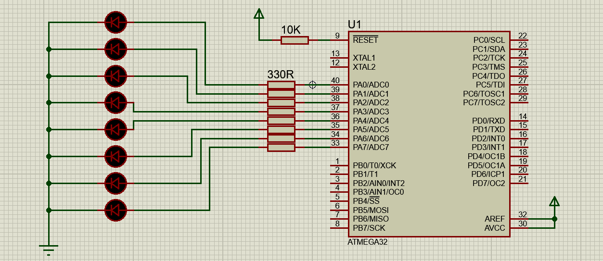

<!-- PROJECT TITLE -->
<h1 align="center">LEDs Blinking Using ATmega32</h1>

<!-- HEADER 
<p align="center">
  
</p>
-->

<!-- OVERVIEW -->
## <br>**➲ Overview**
This project demonstrates how to control 8 LEDs connected to PortA of an ATmega32 microcontroller. The LEDs sequentially light up one by one and then reset (turn off) before starting the sequence again. This project serves as a practical example of using a DIO (Digital Input/Output) driver to control hardware peripherals.

<!-- HARDWARE REQUIREMENTS -->
## <br>**➲ Hardware Requirements**
* IMTSchool Development Kit (or a compatible hardware setup)
* USBASP Programmer (or another suitable programmer)
* Jumper wires

<!-- SOFTWARE REQUIREMENTS -->
## <br>**➲ Software Requirements**
* <a href="https://www.microchip.com/en-us/education/developer-help/learn-tools-software/mcu-mpu/studio" target="_blank">Microship Studio</a> 
* <a href="https://www.labcenter.com/downloads/" target="_blank">Proteus</a> 
* <a href="https://sourceforge.net/projects/winavr/" target="_blank">WinAVR</a> 
* <a href="https://www.fischl.de/usbasp/" target="_blank">USBASP driver</a> 

**NOTE:** you can install another simulation program like multisim and another IDE like VS code with external compiler, anything can work all you need is to compile the project to generate hex file.

<!-- PROJECT STRUCTURE -->
## <br>**➲ Project Structure**
The project is structured as follows:
* main.c: The main application code that controls the LED sequence.
* STD_TYPES.h: A header file containing standard data types for the project.
* BIT_MATH.h: A header file containing bit manipulation macros.
* DIO Driver:
  * DIO_Program.c: The source code for the DIO driver functions.
  * DIO_Interface.h: The interface (header) file for the DIO driver.
  * DIO_Private.h: Private declarations for the DIO driver.

<!-- GETTING STARTED -->
## <br>**➲ Getting Started**
1. **Hardware Setup:**
   * Connect the 8 LEDs to PortA (PA0 to PA7) of the ATmega32 microcontroller on the kit. 

2. **Software Setup:**
* Install Microchip Studio on your computer.
* Set up Proteus for simulation.
* Install the USBASP Programmer software and ensure your programmer is connected.
3. **Clone the Repository:**
```sh
git clone https://github.com/omaarelsherif/LEDs-Blinking-Using-ATmega32.git
```
4. **Build the project:**
   * Build the project using Microship Studio or any another IDE
   * Use the USBASP Programmer to flash the ATmega32 with the generated hex file.
5. **Run the Simulation:**
   * If you want to simulate the project, open it in Proteus and run the simulation.
6. **Enjoy the Blinking LEDs:**
   * Once programmed, the ATmega32 will sequentially light up the LEDs and then reset the sequence.

<!-- OUTPUT -->
## <br>**➲ Output**
<h4>Simulation Design: </h4>
This gif showcases the simulation setup in Proteus, where the LEDs are connected to PortA of the ATmega32 microcontroller. The simulation demonstrates the sequential blinking of the LEDs.



<h4>Hardware Connection (IMTSchool Kit): </h4>
This gif illustrates the physical hardware setup using the IMTSchool Development Kit. The ATmega32 microcontroller is connected to the LEDs on an external kit, mirroring the simulation design.


<!-- CONTACT -->
## <br>**➲ Contact**
- E-mail   : [omaarelsherif@gmail.com](mailto:omaarelsherif@gmail.com)
- LinkedIn : https://www.linkedin.com/in/omaarelsherif/
- Facebook : https://www.facebook.com/omaarelshereif
